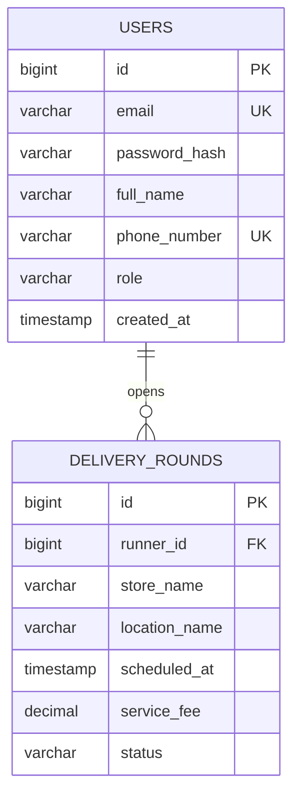

# CS261 Group 5 - Database ER Diagram

## Database ER Diagram (Tasks 04, 08, 16, 20, 24)

```mermaid
erDiagram
    %% Task 08 - เปิดรอบรับหิ้ว
    USERS ||--o{ DELIVERY_ROUNDS : opens
    
    %% Task 04 - ลงทะเบียนหรือเข้าสู่ระบบ
    USERS {
        bigint id PK
        varchar email UK
        varchar password_hash
        varchar full_name
        varchar phone_number UK
        varchar role
        timestamp created_at
    }

    %% Task 08 - เปิดรอบรับหิ้ว
    DELIVERY_ROUNDS {
        bigint id PK
        bigint runner_id FK
        varchar store_name
        varchar location_name
        timestamp scheduled_at
        decimal service_fee
        varchar status
    }
```
